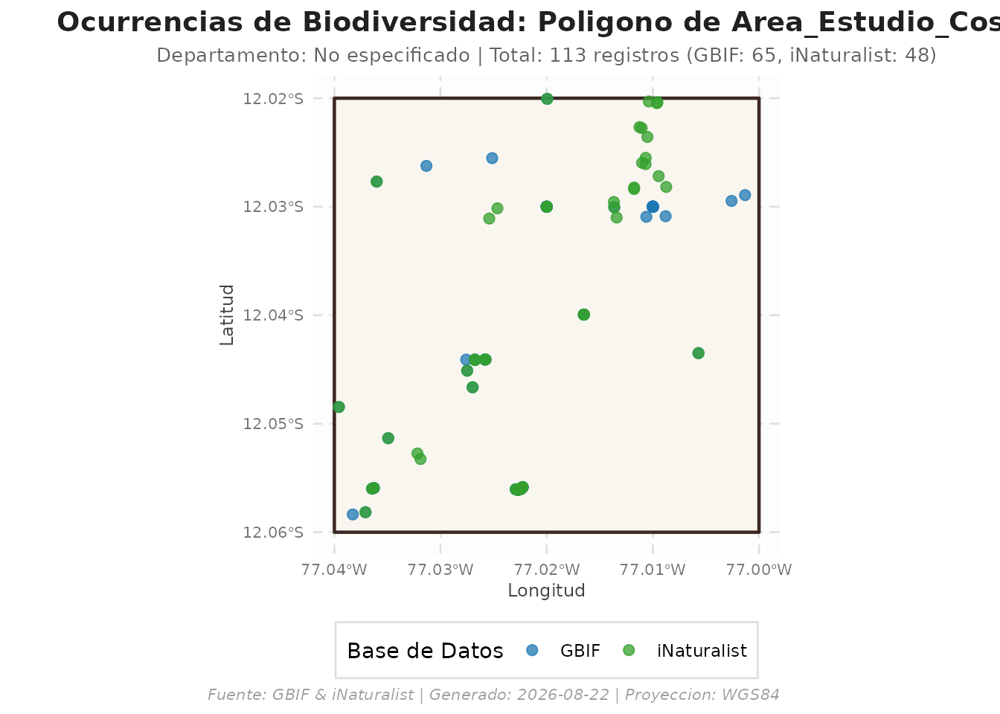
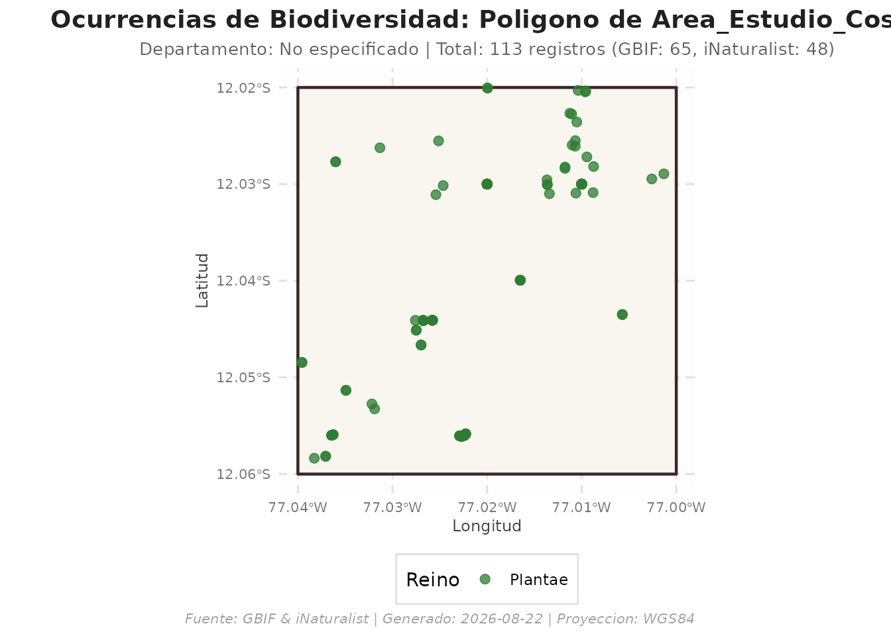

# Búsqueda de Ocurrencias con Polígonos Personalizados (Shapefile, GeoJSON y sf)

## Introducción

Además de realizar consultas sobre las delimitaciones
político-administrativas oficiales del Perú (distritos y provincias),
`peruocc` ofrece la función
[`buscar_especies_poligono()`](https://paulesantos.github.io/peruocc/reference/buscar_especies_poligono.md).

Esta utilidad permite delimitar áreas de estudio independientes, tales
como: \* Polígonos de muestreo de campo y cuadrantes de inventario. \*
Áreas Naturales Protegidas (ANP), concesiones forestales o zonas de
amortiguamiento. \* Áreas de influencia directa/indirecta (buffers) de
proyectos ambientales. \* Archivos espaciales en formatos estándar
(`.shp`, `.geojson`, `.gpkg`, `.kml`).

------------------------------------------------------------------------

## 1. Carga de Librerías y Configuración

Cargamos `peruocc` y `sf` para el manejo de geometrías vectoriales:

``` r

library(peruocc)
library(sf)
#> Linking to GEOS 3.12.1, GDAL 3.8.4, PROJ 9.4.0; sf_use_s2() is TRUE
library(ggplot2)

# Configurar el directorio de trabajo para artefactos y caché
peruocc_data_dir("peruocc-output")
```

------------------------------------------------------------------------

## 2. Creación de un Polígono de Estudio Personalizado

Podemos definir cualquier geometría poligonal en R. En este ejemplo,
creamos un polígono rectangular de interés biológico en la costa central
del Perú (alrededor de los humedales y costa de Lima):

``` r

# Coordenadas de los vértices del polígono (WGS84: Longitud, Latitud)
coordenadas <- matrix(
  c(
    -77.04, -12.06,
    -77.00, -12.06,
    -77.00, -12.02,
    -77.04, -12.02,
    -77.04, -12.06
  ),
  ncol = 2,
  byrow = TRUE
)

# Construir el objeto sf con proyección geográfica EPSG:4326 (WGS84)
mi_zona_estudio <- sf::st_as_sf(
  sf::st_sfc(sf::st_polygon(list(coordenadas)), crs = 4326)
)

print(mi_zona_estudio)
#> Simple feature collection with 1 feature and 0 fields
#> Geometry type: POLYGON
#> Dimension:     XY
#> Bounding box:  xmin: -77.04 ymin: -12.06 xmax: -77 ymax: -12.02
#> Geodetic CRS:  WGS 84
#>                                x
#> 1 POLYGON ((-77.04 -12.06, -7...
```

------------------------------------------------------------------------

## 3. Consulta Integrada de Biodiversidad: `buscar_especies_poligono()`

Ejecutamos la búsqueda de flora dentro del polígono creado. `peruocc`
gestiona automáticamente: 1. La consulta síncrona a **GBIF** con
simplificación adaptativa WKT en UTM. 2. La consulta a **iNaturalist**
por Bounding Box. 3. El **recorte espacial exacto en memoria
([`sf::st_intersects`](https://r-spatial.github.io/sf/reference/geos_binary_pred.html))**
para asegurar que cada punto caiga estrictamente dentro de la geometría.
4. La estandarización y deduplicación bajo el estándar **Darwin Core**.

``` r

resultado_personalizado <- buscar_especies_poligono(
  poligono = mi_zona_estudio,
  nombre = "Area_Estudio_Costa",
  grupo = "flora",
  limite_por_api = 25
)
#> =====================================================================
#> BUSQUEDA INTEGRADA EN POLIGONO PERSONALIZADO: AREA_ESTUDIO_COSTA
#>   Grupo: flora
#> =====================================================================
#> 
#> [LOTE] Procesando 4 lote(s) espaciales. Los resultados completados se guardan en '/home/runner/work/peruocc/peruocc/vignettes/peruocc-output/cache/consultas_ocurrencias'.
#> [GBIF] Iniciando busqueda de ocurrencias...
#> [GBIF] Filtrando por reino Plantae (Flora).
#> [GBIF] Consultando registros dentro del poligono de 'Unidad seleccionada' (limite: 25)...
#> [GBIF] Busqueda finalizada. Se filtraron 25 registros que caen dentro del poligono seleccionado.
#> [iNaturalist] Iniciando busqueda de ocurrencias...
#> [iNaturalist] Filtrando por reino Plantae (Flora).
#> [iNaturalist] Consultando registros dentro de la caja delimitadora de 'Unidad seleccionada' (limite: 25)...
#> [iNaturalist] Se descargaron 25 registros en la caja delimitadora. Aplicando filtro espacial...
#> [iNaturalist] Busqueda finalizada. 25 de 25 registros caen dentro del poligono seleccionado.
#> [GBIF] Iniciando busqueda de ocurrencias...
#> [GBIF] Filtrando por reino Plantae (Flora).
#> [GBIF] Consultando registros dentro del poligono de 'Unidad seleccionada' (limite: 25)...
#> [GBIF] Busqueda finalizada. Se filtraron 1 registros que caen dentro del poligono seleccionado.
#> [iNaturalist] Iniciando busqueda de ocurrencias...
#> [iNaturalist] Filtrando por reino Plantae (Flora).
#> [iNaturalist] Consultando registros dentro de la caja delimitadora de 'Unidad seleccionada' (limite: 25)...
#> [iNaturalist] Se descargaron 1 registros en la caja delimitadora. Aplicando filtro espacial...
#> [iNaturalist] Busqueda finalizada. 1 de 1 registros caen dentro del poligono seleccionado.
#> [GBIF] Iniciando busqueda de ocurrencias...
#> [GBIF] Filtrando por reino Plantae (Flora).
#> [GBIF] Consultando registros dentro del poligono de 'Unidad seleccionada' (limite: 25)...
#> [GBIF] Busqueda finalizada. Se filtraron 14 registros que caen dentro del poligono seleccionado.
#> [iNaturalist] Iniciando busqueda de ocurrencias...
#> [iNaturalist] Filtrando por reino Plantae (Flora).
#> [iNaturalist] Consultando registros dentro de la caja delimitadora de 'Unidad seleccionada' (limite: 25)...
#> [iNaturalist] Se descargaron 14 registros en la caja delimitadora. Aplicando filtro espacial...
#> [iNaturalist] Busqueda finalizada. 13 de 14 registros caen dentro del poligono seleccionado.
#> [GBIF] Iniciando busqueda de ocurrencias...
#> [GBIF] Filtrando por reino Plantae (Flora).
#> [GBIF] Consultando registros dentro del poligono de 'Unidad seleccionada' (limite: 25)...
#> [GBIF] Busqueda finalizada. Se filtraron 25 registros que caen dentro del poligono seleccionado.
#> [iNaturalist] Iniciando busqueda de ocurrencias...
#> [iNaturalist] Filtrando por reino Plantae (Flora).
#> [iNaturalist] Consultando registros dentro de la caja delimitadora de 'Unidad seleccionada' (limite: 25)...
#> [iNaturalist] Se descargaron 9 registros en la caja delimitadora. Aplicando filtro espacial...
#> [iNaturalist] Busqueda finalizada. 9 de 9 registros caen dentro del poligono seleccionado.
#> 
#> [RESULTADO] Consolidacion exitosa. Total de registros unificados: 113
#>        Origen Registros
#> 1        GBIF        65
#> 2 iNaturalist        48
#> 3       Total       113
```

------------------------------------------------------------------------

## 4. Inspección de los Resultados Obtenidos

El objeto devuelto contiene la estructura estándar de `peruocc`:

``` r

# Resumen de registros por base de datos
print(resultado_personalizado$resumen)
#> $nivel
#> [1] "poligono"
#> 
#> $unidad
#> [1] "Area_Estudio_Costa"
#> 
#> $distrito
#> [1] NA
#> 
#> $provincia
#> [1] NA
#> 
#> $departamento
#> [1] NA
#> 
#> $total_registros
#> [1] 113
#> 
#> $registros_gbif
#> [1] 65
#> 
#> $registros_inat
#> [1] 48
#> 
#> $limite_por_api
#> [1] 25
#> 
#> $gbif_total_reportado_api
#> [1] NA
#> 
#> $inat_total_reportado_api
#> [1] NA
#> 
#> $gbif_descarga_completa_api
#> [1] FALSE
#> 
#> $inat_descarga_completa_api
#> [1] FALSE
#> 
#> $lotes_espaciales
#> [1] 4
#> 
#> $fallos_lotes
#> character(0)
#> 
#> $nota_cobertura
#> [1] "Se solicito una muestra limitada por API; la cobertura puede estar truncada."

# Vista previa de las primeras ocurrencias
head(resultado_personalizado$ocurrencias[, c("scientificName", "source", "eventDate", "decimalLatitude", "decimalLongitude")])
#>                         scientificName source           eventDate
#> NA...1   Washingtonia robusta H.Wendl.   GBIF 2026-04-30T11:39:05
#> NA.1...2             Fragaria vesca L.   GBIF    2025-05-01T12:24
#> NA.2...3        Annona cherimola Mill.   GBIF    2025-05-03T09:07
#> NA.3...4        Passiflora edulis Sims   GBIF 2025-06-21T11:49:59
#> NA.4...5               Urtica urens L.   GBIF 2025-08-20T17:38:53
#> NA.5...6       Sonchus asper (L.) Hill   GBIF    2025-10-15T14:47
#>          decimalLatitude decimalLongitude
#> NA...1         -12.05598        -77.03645
#> NA.1...2       -12.03994        -77.01650
#> NA.2...3       -12.03994        -77.01650
#> NA.3...4       -12.04664        -77.02698
#> NA.4...5       -12.05815        -77.03707
#> NA.5...6       -12.05133        -77.03492
```

------------------------------------------------------------------------

## 5. Visualización Cartográfica con `graficar_ocurrencias()`

Podemos generar composiciones en `ggplot2` superponiendo el polígono con
las observaciones:

### A. Clasificación por Proveedor de Datos (GBIF vs iNaturalist)

``` r

mapa_fuentes <- graficar_ocurrencias(
  resultado_lista = resultado_personalizado,
  color_por = "source"
)

print(mapa_fuentes)
```



### B. Clasificación por Reino Taxonómico

``` r

mapa_reinos <- graficar_ocurrencias(
  resultado_lista = resultado_personalizado,
  color_por = "kingdom"
)

print(mapa_reinos)
```



------------------------------------------------------------------------

## 6. Consulta desde un Archivo en Disco (Shapefile / GeoJSON)

[`buscar_especies_poligono()`](https://paulesantos.github.io/peruocc/reference/buscar_especies_poligono.md)
también acepta directamente una ruta a un archivo espacial en disco
(`.shp`, `.geojson`, `.gpkg` o `.kml`).

Para demostrarlo, guardamos el polígono en un archivo `.geojson` y
ejecutamos la consulta directamente desde la ruta:

``` r

# 1. Guardar el polígono temporalmente como archivo GeoJSON
ruta_capa <- file.path(tempdir(), "mi_reserva.geojson")
sf::st_write(mi_zona_estudio, ruta_capa, quiet = TRUE, delete_dsn = TRUE)

# 2. Consultar directamente pasando la ruta del archivo
resultado_desde_archivo <- buscar_especies_poligono(
  poligono = ruta_capa,
  nombre = "Reserva_Local",
  grupo = "flora",
  limite_por_api = 15
)
#> =====================================================================
#> BUSQUEDA INTEGRADA EN POLIGONO PERSONALIZADO: RESERVA_LOCAL
#>   Grupo: flora
#> =====================================================================
#> 
#> [LOTE] Procesando 4 lote(s) espaciales. Los resultados completados se guardan en '/home/runner/work/peruocc/peruocc/vignettes/peruocc-output/cache/consultas_ocurrencias'.
#> [GBIF] Iniciando busqueda de ocurrencias...
#> [GBIF] Filtrando por reino Plantae (Flora).
#> [GBIF] Consultando registros dentro del poligono de 'Unidad seleccionada' (limite: 15)...
#> [GBIF] Busqueda finalizada. Se filtraron 15 registros que caen dentro del poligono seleccionado.
#> [iNaturalist] Iniciando busqueda de ocurrencias...
#> [iNaturalist] Filtrando por reino Plantae (Flora).
#> [iNaturalist] Consultando registros dentro de la caja delimitadora de 'Unidad seleccionada' (limite: 15)...
#> [iNaturalist] Se descargaron 15 registros en la caja delimitadora. Aplicando filtro espacial...
#> [iNaturalist] Busqueda finalizada. 15 de 15 registros caen dentro del poligono seleccionado.
#> [GBIF] Iniciando busqueda de ocurrencias...
#> [GBIF] Filtrando por reino Plantae (Flora).
#> [GBIF] Consultando registros dentro del poligono de 'Unidad seleccionada' (limite: 15)...
#> [GBIF] Busqueda finalizada. Se filtraron 1 registros que caen dentro del poligono seleccionado.
#> [iNaturalist] Iniciando busqueda de ocurrencias...
#> [iNaturalist] Filtrando por reino Plantae (Flora).
#> [iNaturalist] Consultando registros dentro de la caja delimitadora de 'Unidad seleccionada' (limite: 15)...
#> [iNaturalist] Se descargaron 1 registros en la caja delimitadora. Aplicando filtro espacial...
#> [iNaturalist] Busqueda finalizada. 1 de 1 registros caen dentro del poligono seleccionado.
#> [GBIF] Iniciando busqueda de ocurrencias...
#> [GBIF] Filtrando por reino Plantae (Flora).
#> [GBIF] Consultando registros dentro del poligono de 'Unidad seleccionada' (limite: 15)...
#> [GBIF] Busqueda finalizada. Se filtraron 6 registros que caen dentro del poligono seleccionado.
#> [iNaturalist] Iniciando busqueda de ocurrencias...
#> [iNaturalist] Filtrando por reino Plantae (Flora).
#> [iNaturalist] Consultando registros dentro de la caja delimitadora de 'Unidad seleccionada' (limite: 15)...
#> [iNaturalist] Se descargaron 14 registros en la caja delimitadora. Aplicando filtro espacial...
#> [iNaturalist] Busqueda finalizada. 13 de 14 registros caen dentro del poligono seleccionado.
#> [GBIF] Iniciando busqueda de ocurrencias...
#> [GBIF] Filtrando por reino Plantae (Flora).
#> [GBIF] Consultando registros dentro del poligono de 'Unidad seleccionada' (limite: 15)...
#> [GBIF] Busqueda finalizada. Se filtraron 15 registros que caen dentro del poligono seleccionado.
#> [iNaturalist] Iniciando busqueda de ocurrencias...
#> [iNaturalist] Filtrando por reino Plantae (Flora).
#> [iNaturalist] Consultando registros dentro de la caja delimitadora de 'Unidad seleccionada' (limite: 15)...
#> [iNaturalist] Se descargaron 9 registros en la caja delimitadora. Aplicando filtro espacial...
#> [iNaturalist] Busqueda finalizada. 9 de 9 registros caen dentro del poligono seleccionado.
#> 
#> [RESULTADO] Consolidacion exitosa. Total de registros unificados: 75
#>        Origen Registros
#> 1        GBIF        37
#> 2 iNaturalist        38
#> 3       Total        75

# 3. Exportar resultados con manifiesto de reproducibilidad
exportar_resultados(resultado_desde_archivo)
#> [ARCHIVO] Registros tabulares guardados en: '/home/runner/work/peruocc/peruocc/vignettes/peruocc-output/processed/ocurrencias_20260822T022137Z_poligono_reservalocal_flora.csv'
#> [ARCHIVO] Capa espacial GeoJSON guardada en: '/home/runner/work/peruocc/peruocc/vignettes/peruocc-output/processed/ocurrencias_20260822T022137Z_poligono_reservalocal_flora.geojson'
#> [ARCHIVO] Manifiesto guardado en: '/home/runner/work/peruocc/peruocc/vignettes/peruocc-output/processed/manifiesto_20260822T022137Z_poligono_reservalocal_flora.json'
```

------------------------------------------------------------------------

## Conclusión

La función
[`buscar_especies_poligono()`](https://paulesantos.github.io/peruocc/reference/buscar_especies_poligono.md)
extiende la versatilidad de `peruocc`, permitiendo integrar inventarios
biológicos y análisis de biodiversidad sobre cualquier área geográfica
en el Perú sin depender exclusivamente de límites políticos distritales
o provinciales.
