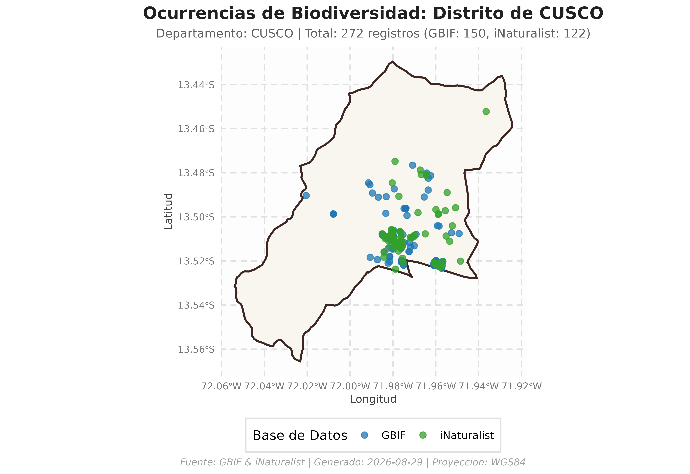

# Primeros Pasos con peruocc

## Introducción

`peruocc` es un paquete en R diseñado para facilitar la búsqueda,
descarga, validación espacial y consolidación de registros de
ocurrencias de biodiversidad (**flora y fauna**) en el territorio
peruano, tomando como marco de referencia las delimitaciones
político-administrativas oficiales provistas por **`geoperu`**
(distritos y provincias).

El paquete integra y estandariza la información proveniente de dos de
las plataformas más representativas en biodiversidad: \* **GBIF**
(*Global Biodiversity Information Facility*) \* **iNaturalist**

------------------------------------------------------------------------

## Instalación y Configuración

Puedes instalar la versión oficial de `peruocc` desde CRAN:

``` r

install.packages("peruocc")
```

O la versión en desarrollo directamente desde GitHub:

``` r

# install.packages("remotes")
remotes::install_github("PaulESantos/peruocc")
```

Carga el paquete en tu sesión de R:

``` r

library(peruocc)
#> ── Cargando peruocc ────────────────────────────────────────────────── v0.1.0 ──
#> ✔ geoperu 0.0.1   • Límites cartográficos oficiales del Perú
#> ✔ rgbif   3.8.5   • Extracción de ocurrencias desde GBIF
#> ✔ rinat   0.1.10  • Observaciones ciudadanas de iNaturalist
#> ✔ sf      1.1.2   • Operaciones geométricas y filtros espaciales
```

### Configuración del Directorio de Trabajo (Opcional)

Puedes establecer una ruta personalizada donde se almacenarán las capas
en caché y los archivos exportados:

``` r

# Configurar carpeta de salida (opcional)
peruocc_data_dir("peruocc-output")
```

------------------------------------------------------------------------

## Consultas de Ocurrencias

Por defecto, las consultas se ejecutan directamente en memoria
(`guardar_resultados = FALSE`), lo que agiliza el flujo interactivo y
previene la creación de archivos no deseados en el disco.

### 1. Búsqueda a Nivel de Distrito

Para consultar registros en un distrito específico (por ejemplo, el
distrito de **Cusco**, en la provincia y departamento de **Cusco**):

``` r

resultado_cusco <- buscar_especies_distrito(
  distrito = "Cusco",
  departamento = "Cusco",
  provincia = "Cusco",
  grupo = "flora",            # "flora", "fauna" o NULL
  limite_por_api = 150
)
#> 
#> ── Búsqueda Integrada: CUSCO (DISTRITO) ────────────────────────────────────────
#> • Departamento: Cusco
#> • Provincia: Cusco
#> • Grupo: flora
#> ℹ Cargando límites de CUSCO desde el caché local...
#> ℹ [GBIF] Iniciando búsqueda de ocurrencias...
#> ✔ Polígono simplificado con éxito a tolerancia de 100 metros (WKT: 1153 caracteres).
#> ℹ [GBIF] Filtrando por reino Plantae (Flora).
#> ℹ [GBIF] Consultando registros dentro del polígono de CUSCO (límite: "150")...
#> ✔ [GBIF] Búsqueda finalizada. Se filtraron 150 registro(s) que caen dentro del polígono seleccionado.
#> ℹ [iNaturalist] Iniciando búsqueda de ocurrencias...
#> ℹ [iNaturalist] Filtrando por reino Plantae (Flora).
#> ℹ [iNaturalist] Consultando registros dentro de la caja delimitadora de CUSCO (límite: "150")...
#> ℹ [iNaturalist] Se descargaron 150 registros en la caja delimitadora. Aplicando filtro espacial...
#> ✔ [iNaturalist] Búsqueda finalizada. 122 de 150 registros caen dentro del polígono seleccionado.
#> ✔ Consolidación exitosa. Total de registros unificados: 272
#> 
#> ── Resumen de Registros ──
#> 
#> • GBIF: 150 registro(s)
#> • iNaturalist: 122 registro(s)
#> ✔ Total consolidado: 272 registro(s)
```

### 2. Búsqueda a Nivel de Provincia

Para consultar una provincia completa (donde `peruocc` disuelve
automáticamente las geometrías distritales):

``` r

resultado_urubamba <- buscar_especies_provincia(
  provincia = "Urubamba",
  departamento = "Cusco",
  grupo = "fauna",
  limite_por_api = 200
)
#> 
#> ── Búsqueda Integrada: URUBAMBA (PROVINCIA) ────────────────────────────────────
#> • Departamento: Cusco
#> • Grupo: fauna
#> ℹ Procesando 10 lotes espaciales (distritos): "MARAS", "HUAYLLABAMBA", "YUCAY", "CHINCHERO", "OLLANTAYTAMBO", "MACHUPICCHU", and "URUBAMBA"
#> ✔ Polígono simplificado con éxito a tolerancia de 100 metros (WKT: 1213 caracteres).
#> ✔ Lote 1/10 [MARAS]: 190 (GBIF) + 90 (iNat) = 280 registros.
#> ✔ Polígono simplificado con éxito a tolerancia de 100 metros (WKT: 1211 caracteres).
#> ✔ Lote 2/10 [HUAYLLABAMBA]: 200 (GBIF) + 98 (iNat) = 298 registros.
#> ✔ Polígono simplificado con éxito a tolerancia de 100 metros (WKT: 608 caracteres).
#> ✔ Lote 3/10 [YUCAY]: 200 (GBIF) + 84 (iNat) = 284 registros.
#> ✔ Polígono simplificado con éxito a tolerancia de 100 metros (WKT: 865 caracteres).
#> ✔ Lote 4/10 [CHINCHERO]: 200 (GBIF) + 190 (iNat) = 390 registros.
#> ✔ Polígono simplificado con éxito a tolerancia de 300 metros (WKT: 898 caracteres).
#> ✔ Lote 5/10 [OLLANTAYTAMBO]: 166 (GBIF) + 14 (iNat) = 180 registros.
#> ✔ Polígono simplificado con éxito a tolerancia de 100 metros (WKT: 819 caracteres).
#> ✔ Lote 6/10 [OLLANTAYTAMBO]: 200 (GBIF) + 111 (iNat) = 311 registros.
#> ✔ Lote 7/10 [OLLANTAYTAMBO]: 7 (GBIF) + 0 (iNat) = 7 registros.
#> ✔ Polígono simplificado con éxito a tolerancia de 100 metros (WKT: 1157 caracteres).
#> ✔ Lote 8/10 [OLLANTAYTAMBO]: 200 (GBIF) + 101 (iNat) = 301 registros.
#> ✔ Polígono simplificado con éxito a tolerancia de 300 metros (WKT: 897 caracteres).
#> ✔ Lote 9/10 [MACHUPICCHU]: 200 (GBIF) + 197 (iNat) = 397 registros.
#> ✔ Polígono simplificado con éxito a tolerancia de 100 metros (WKT: 1466 caracteres).
#> ✔ Lote 10/10 [URUBAMBA]: 200 (GBIF) + 180 (iNat) = 380 registros.
#> ✔ Consolidación exitosa. Total de registros unificados: 2828
#> 
#> ── Resumen de Registros ──
#> 
#> • GBIF: 1763 registro(s)
#> • iNaturalist: 1065 registro(s)
#> ✔ Total consolidado: 2828 registro(s)
```

### 3. Filtro por Especie o Taxón Específico

También es posible restringir la búsqueda a un taxón en particular
utilizando el argumento `nombre_cientifico`:

``` r

resultado_jaguar <- buscar_especies_distrito(
  distrito = "Tambopata",
  departamento = "Madre de Dios",
  provincia = "Tambopata",
  nombre_cientifico = "Panthera onca",
  limite_por_api = 50
)
#> 
#> ── Búsqueda Integrada: TAMBOPATA (DISTRITO) ────────────────────────────────────
#> • Departamento: Madre de Dios
#> • Provincia: Tambopata
#> • Taxón: Panthera onca
#> ℹ Cargando límites de MADRE DE DIOS desde el caché local...
#> ℹ [GBIF] Iniciando búsqueda de ocurrencias...
#> ✔ Polígono simplificado con éxito a tolerancia de 8100 metros (WKT: 379 caracteres).
#> ℹ [GBIF] Resolviendo taxonomía para "Panthera onca"...
#> ✔ [GBIF] Taxón resuelto: Panthera onca (Linnaeus, 1758) (Key: 5219426, Rank: SPECIES)
#> ℹ [GBIF] Consultando registros dentro del polígono de TAMBOPATA (límite: "50")...
#> ✔ [GBIF] Búsqueda finalizada. Se filtraron 21 registro(s) que caen dentro del polígono seleccionado.
#> ℹ [iNaturalist] Iniciando búsqueda de ocurrencias...
#> ℹ [iNaturalist] Consultando registros dentro de la caja delimitadora de TAMBOPATA (límite: "50")...
#> ℹ [iNaturalist] Se descargaron 50 registros en la caja delimitadora. Aplicando filtro espacial...
#> ✔ [iNaturalist] Búsqueda finalizada. 8 de 50 registros caen dentro del polígono seleccionado.
#> ✔ Consolidación exitosa. Total de registros unificados: 29
#> 
#> ── Resumen de Registros ──
#> 
#> • GBIF: 21 registro(s)
#> • iNaturalist: 8 registro(s)
#> ✔ Total consolidado: 29 registro(s)
```

------------------------------------------------------------------------

## Estructura del Objeto Consolidado

Las funciones de búsqueda retornan un objeto de tipo `list` estructurado
con 4 componentes clave:

``` r

names(resultado_cusco)
#> [1] "unidad_sf"   "distrito_sf" "ocurrencias" "resumen"     "parametros"
#> [1] "unidad_sf"   "ocurrencias" "resumen"     "parametros"
```

| Componente | Tipo | Descripción |
|:---|:---|:---|
| **`unidad_sf`** | `sf` (WGS84) | Polígono oficial validado y proyectado en EPSG:4326. |
| **`ocurrencias`** | `peruocc_tbl` / `data.frame` | Registros estandarizados bajo el estándar **Darwin Core**. |
| **`resumen`** | `list` | Estadísticas de la consulta (conteo total, por fuente, reinos). |
| **`parametros`** | `list` | Metadatos y filtros utilizados en la llamada (fechas, límites). |

### Inspección de Registros

``` r

# Vista previa de las primeras ocurrencias
head(resultado_cusco$ocurrencias[, c("scientificName", "source", "eventDate", "decimalLatitude", "decimalLongitude")])
#> # A tibble: 6 × 5
#>   scientificName source   eventDate decimalLatitude decimalLongitude
#>   <chr>          <chr>    <chr>               <dbl>            <dbl>
#> 1 Passiflora pi… GBIF     2026-01-…           -13.5            -72.0
#> 2 Salix babylon… GBIF     2026-01-…           -13.5            -72.0
#> 3 Tecoma stans … GBIF     2026-01-…           -13.5            -72.0
#> 4 Austrocylindr… GBIF     2026-01-…           -13.5            -72.0
#> 5 Cirsium vulga… GBIF     2026-01-…           -13.5            -72.0
#> 6 Cantua buxifo… GBIF     2026-01-…           -13.5            -72.0
```

------------------------------------------------------------------------

## Visualización y Exportación

### Visualización Rápida

Puedes generar inmediatamente un mapa temático con `ggplot2`:

``` r

# Visualizar mapa coloreando por repositorio de origen (GBIF vs iNaturalist)
mapa <- graficar_ocurrencias(resultado_cusco, color_por = "source")
print(mapa)
```



### Exportación a Disco

Para guardar los datos en formatos estándar (`CSV`, `GeoJSON` y
`manifiesto JSON` de reproducibilidad):

``` r

# Exportar resultados a disco
exportar_resultados(resultado_cusco)
#> ✔ Registros tabulares guardados en: /home/runner/work/peruocc/peruocc/vignettes/peruocc-output/processed/ocurrencias_20260829T165238Z_distrito_cusco_flora.csv
#> ✔ Capa espacial GeoJSON guardada en: /home/runner/work/peruocc/peruocc/vignettes/peruocc-output/processed/ocurrencias_20260829T165238Z_distrito_cusco_flora.geojson
#> ✔ Manifiesto JSON guardado en: /home/runner/work/peruocc/peruocc/vignettes/peruocc-output/processed/manifiesto_20260829T165238Z_distrito_cusco_flora.json
```

------------------------------------------------------------------------

## Siguientes Pasos

Para profundizar en las capacidades de `peruocc`, consulta las viñetas
especializadas:

- **[Flujo Espacial y Filtrado Topológico
  Riguroso](https://paulesantos.github.io/peruocc/articles/flujo_espacial.md)**:
  Detalles de simplificación métrica UTM, corrección CCW y estrategias
  de partición.
- **[Búsqueda con Polígonos
  Personalizados](https://paulesantos.github.io/peruocc/articles/busqueda_poligono_usuario.md)**:
  Consultas con shapefiles, buffers, áreas naturales protegidas y capas
  vectoriales propias.
- **[Configuración, Exportación y
  Visualización](https://paulesantos.github.io/peruocc/articles/visualizacion_y_exportacion.md)**:
  Integración con SIG (QGIS/ArcGIS), personalización de mapas con
  ggplot2 y manifiestos de auditoría científica.
