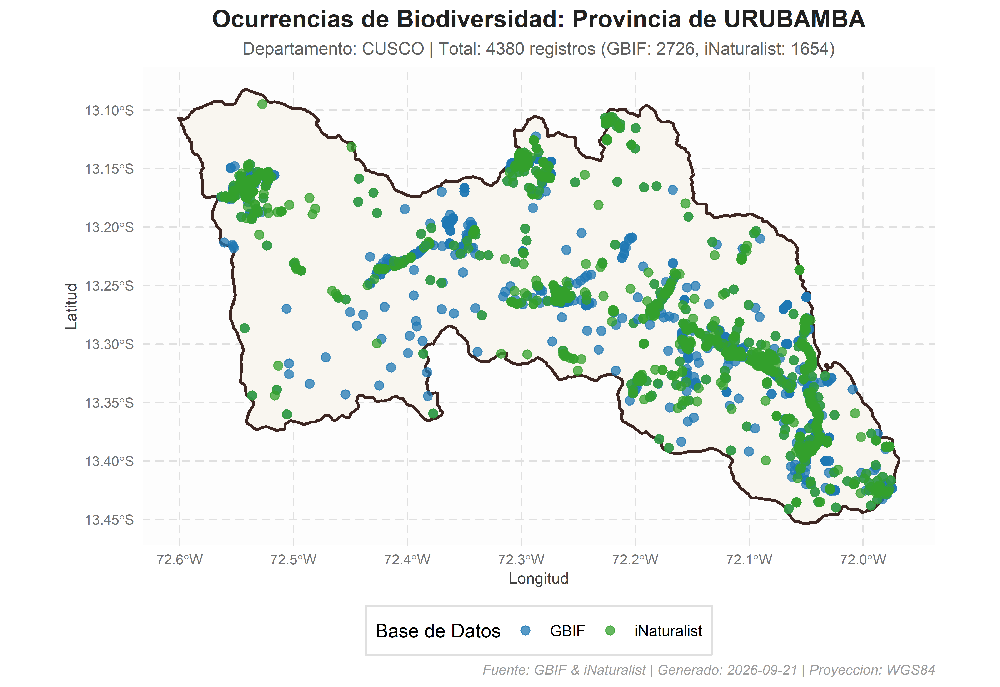

# peruocc: Recuperación y Consolidación de Ocurrencias de Biodiversidad en Unidades Administrativas del Perú

`peruocc` es un paquete y conjunto de herramientas en R diseñado para
buscar, descargar, filtrar, validar y consolidar registros de
ocurrencias de biodiversidad (**flora y fauna**) en el territorio
peruano, utilizando como marco espacial las delimitaciones
administrativas oficiales a escala de **distritos** y **provincias**.

El paquete integra y estandariza la información disponible de dos de los
mayores repositorios globales de biodiversidad: **GBIF** (*Global
Biodiversity Information Facility*) e **iNaturalist**, generando un
objeto unificado con atributos estandarizados y trazabilidad completa
dentro del área de interés.

------------------------------------------------------------------------

## Características Principales

1.  **Marco Administrativo Oficial (Distritos y Provincias)**:
    - Recupera dinámicamente geometrías oficiales provistas por el INEI
      a través del paquete **`geoperu`**.
    - Admite consultas a nivel de **distrito** y consolidación disuelta
      a nivel de **provincia**.
2.  **Caché Local Inteligente (`.rds`)**:
    - Almacena en disco los límites departamentales descargados,
      reduciendo drásticamente los tiempos de respuesta en consultas
      recurrentes.
3.  **Flujo Espacial y Topológico Riguroso**:
    - Corrige automáticamente la orientación geométrica a sentido
      antihorario (**CCW**) según los estándares OGC/GBIF.
    - Aplica simplificación métrica adaptativa en proyecciones UTM para
      polígonos complejos en consultas de API.
    - Realiza una **intersección espacial exacta
      ([`sf::st_intersects`](https://r-spatial.github.io/sf/reference/geos_binary_pred.html))**
      en R con el polígono detallado original, garantizando que sólo se
      conserven los registros estrictamente dentro de los límites
      administrativos.
4.  **Consolidación y Estandarización de Datos**:
    - Homogeneiza atributos de GBIF e iNaturalist hacia un esquema
      estándar alineado con **Darwin Core**.
    - Retorna una estructura consolidada que contiene el polígono
      espacial (`sf`), el conjunto de ocurrencias tabulares
      (`data.frame`), el resumen analítico y los parámetros de
      ejecución.
5.  **Exportación y Trazabilidad**:
    - Exporta automáticamente a formatos **CSV**, capas espaciales
      **GeoJSON**, mapas de alta resolución (**PNG**) y manifiestos de
      reproducibilidad (**JSON**).

------------------------------------------------------------------------

## Flujo de Integración de Datos

``` text
               ┌──────────────────────────────┐
               │    Unidad Administrativa     │
               │   (Distrito o Provincia)     │
               └──────────────┬───────────────┘
                              │
               ┌──────────────▼──────────────┐
               │  Geometría Oficial geoperu   │
               │   + Validación / Caché RDS   │
               └──────────────┬───────────────┘
                              │
             ┌────────────────┴────────────────┐
             │                                 │
  ┌──────────▼──────────┐           ┌──────────▼──────────┐
  │  Consulta a GBIF    │           │ Consulta iNaturalist│
  │  (WKT / Taxonomía)  │           │   (Bounding Box)    │
  └──────────┬──────────┘           └──────────┬──────────┘
             │                                 │
             └────────────────┬────────────────┘
                              │
               ┌──────────────▼──────────────┐
               │ Filtrado Espacial en R       │
               │ (sf::st_intersects exacto)  │
               └──────────────┬───────────────┘
                              │
               ┌──────────────▼──────────────┐
               │ Estandarización Darwin Core │
               │   + Deduplicación interna   │
               └──────────────┬───────────────┘
                              │
               ┌──────────────▼──────────────┐
               │ Objeto Consolidado Final     │
               │ (sf + data.frame + Resumen) │
               └─────────────────────────────┘
```

1.  **Obtención y Preparación del Polígono**: Se consulta `geoperu` para
    descargar o cargar desde el caché local el departamento
    correspondiente. Si la consulta es distrital, se extrae el distrito
    específico; si es provincial, se disuelven espacialmente todos sus
    distritos componentes
    ([`sf::st_union`](https://r-spatial.github.io/sf/reference/geos_combine.html)).
2.  **Consulta a Repositorios Vivos**:
    - **GBIF**: Se envía el polígono en formato WKT (simplificado si
      supera límites de caracteres) junto con los filtros taxonómicos
      (Reino, taxón específico o grupo).
    - **iNaturalist**: Se utiliza la caja delimitadora (*Bounding Box*)
      del polígono junto a los criterios de búsqueda (flora/fauna, taxón
      o texto libre).
3.  **Validación Espacial en Memoria**: Ambos conjuntos de puntos
    recuperados se transforman a objetos espaciales `sf` (EPSG:4326) y
    se intersecan topológicamente con el polígono detallado original,
    eliminando cualquier falso positivo fuera del perímetro.
4.  **Estandarización**: Se mapean los campos nativos de ambas fuentes a
    una estructura de columnas común, preservando identificadores de
    origen, coordenadas, taxonomía, fecha y jerarquía administrativa.

------------------------------------------------------------------------

## Instalación y Carga

### 1. Desde GitHub:

``` r

# Instalar paquete directamente desde el repositorio en GitHub
# install.packages("remotes")
remotes::install_github("PaulESantos/peruocc")
```

### 2. Configuración de directorio de trabajo:

``` r

library(peruocc)
#> ── Cargando peruocc ────────────────────────────────────────────────── v0.1.0 ──
#> ✔ geoperu 0.0.2   • Límites cartográficos oficiales del Perú
#> ✔ rgbif   3.8.5   • Extracción de ocurrencias desde GBIF
#> ✔ rinat   0.1.10  • Observaciones ciudadanas de iNaturalist
#> ✔ sf      1.1.1   • Operaciones geométricas y filtros espaciales

# Configurar directorio donde se guardarán caché, resultados y manifiestos
peruocc_data_dir("peruocc-output")
```

------------------------------------------------------------------------

## Guía de Uso y Escalabilidad Funcional

El paquete proporciona interfaces tanto específicas como unificadas para
consultar ocurrencias en diferentes niveles administrativos:

### 1. Consulta Unificada (`buscar_especies_peru`)

Permite seleccionar el nivel administrativo mediante el argumento
`nivel = c("distrito", "provincia")`:

``` r


# Consulta general a nivel distrital en memoria
res_distrito <- buscar_especies_peru(
  nombre = "Miraflores",
  nivel = "distrito",
  departamento = "Lima",
  provincia = "Lima",
  grupo = "flora",            # "flora", "fauna" o NULL
  limite_por_api = 200
)
#> 
#> ── Búsqueda Integrada: MIRAFLORES (DISTRITO) ───────────────────────────────────
#> • Departamento: Lima
#> • Provincia: Lima
#> • Grupo: flora
#> ℹ Cargando límites de LIMA desde el caché local...
#> ✔ Consolidación exitosa. Total de registros unificados: 365
#> 
#> ── Resumen de Registros ──
#> 
#> • GBIF: 198 registro(s)
#> • iNaturalist: 167 registro(s)
#> ✔ Total consolidado: 365 registro(s)

res_distrito$ocurrencias 
#> # A tibble: 365 × 24
#>    occurrenceID sourceRecordID sourceURL datasetKey license  basisOfRecord
#>    <chr>        <chr>          <chr>     <chr>      <chr>    <chr>        
#>  1 6129981207   6129981207     https://… 50c9509d-… http://… HUMAN_OBSERV…
#>  2 6179051389   6179051389     https://… 50c9509d-… http://… HUMAN_OBSERV…
#>  3 6147543635   6147543635     https://… 50c9509d-… http://… HUMAN_OBSERV…
#>  4 6147566368   6147566368     https://… 50c9509d-… http://… HUMAN_OBSERV…
#>  5 6147649969   6147649969     https://… 50c9509d-… http://… HUMAN_OBSERV…
#>  6 6159649674   6159649674     https://… 50c9509d-… http://… HUMAN_OBSERV…
#>  7 6171247345   6171247345     https://… 50c9509d-… http://… HUMAN_OBSERV…
#>  8 6179365614   6179365614     https://… 50c9509d-… http://… HUMAN_OBSERV…
#>  9 6431906476   6431906476     https://… 50c9509d-… http://… HUMAN_OBSERV…
#> 10 6178459982   6178459982     https://… 50c9509d-… http://… HUMAN_OBSERV…
#> # ℹ 355 filas más
#> # ℹ 18 variables más: scientificName <chr>, decimalLatitude <dbl>,
#> #   decimalLongitude <dbl>, eventDate <chr>, taxonRank <chr>, kingdom <chr>,
#> #   phylum <chr>, class <chr>, order <chr>, family <chr>, genus <chr>,
#> #   species <chr>, recordedBy <chr>, coordinateUncertaintyInMeters <dbl>,
#> #   source <chr>, district <chr>, province <chr>, department <chr>
#> # ℹ Use `print(n = ...)` para ver más filas

# Consulta general a nivel provincial en memoria
res_provincia <- buscar_especies_peru(
  nombre = "Cusco",
  nivel = "provincia",
  departamento = "Cusco",
  grupo = "fauna",
  limite_por_api = 200
)
#> 
#> ── Búsqueda Integrada: CUSCO (PROVINCIA) ───────────────────────────────────────
#> • Departamento: Cusco
#> • Grupo: fauna
#> ℹ Cargando límites de CUSCO desde el caché local...
#> ℹ Procesando 8 lotes espaciales (distritos): "SANTIAGO", "WANCHAQ", "CCORCA", "SAN SEBASTIAN", "SAYLLA", "POROY", "SAN JERONIMO", and "CUSCO"
#> ℹ Lote 1/8 [SANTIAGO]: recuperado de checkpoint (287 registros).
#> ℹ Lote 2/8 [WANCHAQ]: recuperado de checkpoint (295 registros).
#> ℹ Lote 3/8 [CCORCA]: recuperado de checkpoint (203 registros).
#> ℹ Lote 4/8 [SAN SEBASTIAN]: recuperado de checkpoint (216 registros).
#> ℹ Lote 5/8 [SAYLLA]: recuperado de checkpoint (229 registros).
#> ℹ Lote 6/8 [POROY]: recuperado de checkpoint (204 registros).
#> ℹ Lote 7/8 [SAN JERONIMO]: recuperado de checkpoint (342 registros).
#> ℹ Lote 8/8 [CUSCO]: recuperado de checkpoint (365 registros).
#> ✔ Consolidación exitosa. Total de registros unificados: 2141
#> 
#> ── Resumen de Registros ──
#> 
#> • GBIF: 1597 registro(s)
#> • iNaturalist: 544 registro(s)
#> ✔ Total consolidado: 2141 registro(s)

res_provincia$ocurrencias 
#> # A tibble: 2,141 × 24
#>    occurrenceID sourceRecordID sourceURL datasetKey license  basisOfRecord
#>    <chr>        <chr>          <chr>     <chr>      <chr>    <chr>        
#>  1 6130955903   6130955903     https://… 50c9509d-… http://… HUMAN_OBSERV…
#>  2 6147676011   6147676011     https://… 50c9509d-… http://… HUMAN_OBSERV…
#>  3 6147584943   6147584943     https://… 50c9509d-… http://… HUMAN_OBSERV…
#>  4 6147634578   6147634578     https://… 50c9509d-… http://… HUMAN_OBSERV…
#>  5 6171147726   6171147726     https://… 50c9509d-… http://… HUMAN_OBSERV…
#>  6 6452273700   6452273700     https://… 50c9509d-… http://… HUMAN_OBSERV…
#>  7 6195560404   6195560404     https://… 50c9509d-… http://… HUMAN_OBSERV…
#>  8 6414124325   6414124325     https://… 50c9509d-… http://… HUMAN_OBSERV…
#>  9 6481433622   6481433622     https://… 50c9509d-… http://… HUMAN_OBSERV…
#> 10 5087130717   5087130717     https://… 50c9509d-… http://… HUMAN_OBSERV…
#> # ℹ 2,131 filas más
#> # ℹ 18 variables más: scientificName <chr>, decimalLatitude <dbl>,
#> #   decimalLongitude <dbl>, eventDate <chr>, taxonRank <chr>, kingdom <chr>,
#> #   phylum <chr>, class <chr>, order <chr>, family <chr>, genus <chr>,
#> #   species <chr>, recordedBy <chr>, coordinateUncertaintyInMeters <dbl>,
#> #   source <chr>, district <chr>, province <chr>, department <chr>
#> # ℹ Use `print(n = ...)` para ver más filas
```

### 2. Consultas Específicas por Nivel

#### A. A nivel de Distrito (`buscar_especies_distrito`)

``` r

resultado_dist <- buscar_especies_distrito(
  distrito = "Tambopata",
  departamento = "Madre de Dios",
  provincia = "Tambopata",
  nombre_cientifico = "Panthera onca", # Opcional: filtro por especie
  limite_por_api = 100,
  guardar_resultados = FALSE
)
#> 
#> ── Búsqueda Integrada: TAMBOPATA (DISTRITO) ────────────────────────────────────
#> • Departamento: Madre de Dios
#> • Provincia: Tambopata
#> • Taxón: Panthera onca
#> ℹ Cargando límites de MADRE DE DIOS desde el caché local...
#> ✔ Consolidación exitosa. Total de registros unificados: 36
#> 
#> ── Resumen de Registros ──
#> 
#> • GBIF: 21 registro(s)
#> • iNaturalist: 15 registro(s)
#> ✔ Total consolidado: 36 registro(s)

resultado_dist$ocurrencias 
#> # A tibble: 36 × 24
#>    occurrenceID sourceRecordID sourceURL datasetKey license  basisOfRecord
#>    <chr>        <chr>          <chr>     <chr>      <chr>    <chr>        
#>  1 6334829706   6334829706     https://… 50c9509d-… http://… HUMAN_OBSERV…
#>  2 4597092810   4597092810     https://… 50c9509d-… http://… HUMAN_OBSERV…
#>  3 4606894492   4606894492     https://… 50c9509d-… http://… HUMAN_OBSERV…
#>  4 4022300813   4022300813     https://… 50c9509d-… http://… HUMAN_OBSERV…
#>  5 4852820765   4852820765     https://… 50c9509d-… http://… HUMAN_OBSERV…
#>  6 1990572488   1990572488     https://… 50c9509d-… http://… HUMAN_OBSERV…
#>  7 1571080404   1571080404     https://… 50c9509d-… http://… HUMAN_OBSERV…
#>  8 1571080408   1571080408     https://… 50c9509d-… http://… HUMAN_OBSERV…
#>  9 6236055510   6236055510     https://… 50c9509d-… http://… HUMAN_OBSERV…
#> 10 3499457688   3499457688     https://… 50c9509d-… http://… HUMAN_OBSERV…
#> # ℹ 26 filas más
#> # ℹ 18 variables más: scientificName <chr>, decimalLatitude <dbl>,
#> #   decimalLongitude <dbl>, eventDate <chr>, taxonRank <chr>, kingdom <chr>,
#> #   phylum <chr>, class <chr>, order <chr>, family <chr>, genus <chr>,
#> #   species <chr>, recordedBy <chr>, coordinateUncertaintyInMeters <dbl>,
#> #   source <chr>, district <chr>, province <chr>, department <chr>
#> # ℹ Use `print(n = ...)` para ver más filas
```

#### B. A nivel de Provincia (`buscar_especies_provincia`)

``` r

resultado_prov <- buscar_especies_provincia(
  provincia = "Urubamba",
  departamento = "Cusco",
  grupo = "flora",
  limite_por_api = 300,
  guardar_resultados = FALSE
)
#> 
#> ── Búsqueda Integrada: URUBAMBA (PROVINCIA) ────────────────────────────────────
#> • Departamento: Cusco
#> • Grupo: flora
#> ℹ Procesando 10 lotes espaciales (distritos): "MARAS", "HUAYLLABAMBA", "YUCAY", "CHINCHERO", "OLLANTAYTAMBO", "MACHUPICCHU", and "URUBAMBA"
#> ℹ Lote 1/10 [MARAS]: recuperado de checkpoint (490 registros).
#> ℹ Lote 2/10 [HUAYLLABAMBA]: recuperado de checkpoint (443 registros).
#> ℹ Lote 3/10 [YUCAY]: recuperado de checkpoint (436 registros).
#> ℹ Lote 4/10 [CHINCHERO]: recuperado de checkpoint (529 registros).
#> ℹ Lote 5/10 [OLLANTAYTAMBO]: recuperado de checkpoint (239 registros).
#> ℹ Lote 6/10 [OLLANTAYTAMBO]: recuperado de checkpoint (496 registros).
#> ℹ Lote 7/10 [OLLANTAYTAMBO]: recuperado de checkpoint (126 registros).
#> ℹ Lote 8/10 [OLLANTAYTAMBO]: recuperado de checkpoint (495 registros).
#> ℹ Lote 9/10 [MACHUPICCHU]: recuperado de checkpoint (585 registros).
#> ℹ Lote 10/10 [URUBAMBA]: recuperado de checkpoint (512 registros).
#> ✔ Consolidación exitosa. Total de registros unificados: 4351
#> 
#> ── Resumen de Registros ──
#> 
#> • GBIF: 2713 registro(s)
#> • iNaturalist: 1638 registro(s)
#> ✔ Total consolidado: 4351 registro(s)
resultado_prov$ocurrencias
#> # A tibble: 4,351 × 24
#>    occurrenceID sourceRecordID sourceURL datasetKey license  basisOfRecord
#>    <chr>        <chr>          <chr>     <chr>      <chr>    <chr>        
#>  1 6129994865   6129994865     https://… 50c9509d-… http://… HUMAN_OBSERV…
#>  2 6133077300   6133077300     https://… 50c9509d-… http://… HUMAN_OBSERV…
#>  3 6133103490   6133103490     https://… 50c9509d-… http://… HUMAN_OBSERV…
#>  4 6133145835   6133145835     https://… 50c9509d-… http://… HUMAN_OBSERV…
#>  5 6133173410   6133173410     https://… 50c9509d-… http://… HUMAN_OBSERV…
#>  6 6133262570   6133262570     https://… 50c9509d-… http://… HUMAN_OBSERV…
#>  7 6133393442   6133393442     https://… 50c9509d-… http://… HUMAN_OBSERV…
#>  8 6133461000   6133461000     https://… 50c9509d-… http://… HUMAN_OBSERV…
#>  9 6171289527   6171289527     https://… 50c9509d-… http://… HUMAN_OBSERV…
#> 10 6178591915   6178591915     https://… 50c9509d-… http://… HUMAN_OBSERV…
#> # ℹ 4,341 filas más
#> # ℹ 18 variables más: scientificName <chr>, decimalLatitude <dbl>,
#> #   decimalLongitude <dbl>, eventDate <chr>, taxonRank <chr>, kingdom <chr>,
#> #   phylum <chr>, class <chr>, order <chr>, family <chr>, genus <chr>,
#> #   species <chr>, recordedBy <chr>, coordinateUncertaintyInMeters <dbl>,
#> #   source <chr>, district <chr>, province <chr>, department <chr>
#> # ℹ Use `print(n = ...)` para ver más filas
```

#### C. Con Polígonos Personalizados / Shapefile (`buscar_especies_poligono`)

Permite realizar consultas sobre cualquier delimitación espacial
provista por el usuario (objeto `sf` o archivo `.shp`, `.geojson`,
`.gpkg`, `.kml`):

``` r

# Crear un polígono de muestreo en EPSG:4326
poly_coords <- matrix(c(-77.04, -12.06, -77.00, -12.06, -77.00, -12.02, -77.04, -12.02, -77.04, -12.06), ncol = 2, byrow = TRUE)
zona_estudio <- sf::st_as_sf(sf::st_sfc(sf::st_polygon(list(poly_coords)), crs = 4326))

resultado_custom <- buscar_especies_poligono(
  poligono = zona_estudio,
  nombre = "Zona_Muestreo_1",
  grupo = "flora",
  limite_por_api = 100
)
#> 
#> ── Búsqueda Integrada en Polígono: ZONA_MUESTREO_1 ─────────────────────────────
#> • Grupo: flora
#> ✔ Consolidación exitosa. Total de registros unificados: 172
#> 
#> ── Resumen de Registros ──
#> 
#> • GBIF: 100 registro(s)
#> • iNaturalist: 72 registro(s)
#> ✔ Total consolidado: 172 registro(s)

resultado_custom$ocurrencias 
#> # A tibble: 172 × 24
#>    occurrenceID sourceRecordID sourceURL datasetKey license  basisOfRecord
#>    <chr>        <chr>          <chr>     <chr>      <chr>    <chr>        
#>  1 6273615758   6273615758     https://… 50c9509d-… http://… HUMAN_OBSERV…
#>  2 5166843306   5166843306     https://… 50c9509d-… http://… HUMAN_OBSERV…
#>  3 5215721628   5215721628     https://… 50c9509d-… http://… HUMAN_OBSERV…
#>  4 5230941804   5230941804     https://… 50c9509d-… http://… HUMAN_OBSERV…
#>  5 5935225529   5935225529     https://… 50c9509d-… http://… HUMAN_OBSERV…
#>  6 6130845716   6130845716     https://… 50c9509d-… http://… HUMAN_OBSERV…
#>  7 6178303497   6178303497     https://… 50c9509d-… http://… HUMAN_OBSERV…
#>  8 6178484421   6178484421     https://… 50c9509d-… http://… HUMAN_OBSERV…
#>  9 6178594536   6178594536     https://… 50c9509d-… http://… HUMAN_OBSERV…
#> 10 6178747062   6178747062     https://… 50c9509d-… http://… HUMAN_OBSERV…
#> # ℹ 162 filas más
#> # ℹ 18 variables más: scientificName <chr>, decimalLatitude <dbl>,
#> #   decimalLongitude <dbl>, eventDate <chr>, taxonRank <chr>, kingdom <chr>,
#> #   phylum <chr>, class <chr>, order <chr>, family <chr>, genus <chr>,
#> #   species <chr>, recordedBy <chr>, coordinateUncertaintyInMeters <dbl>,
#> #   source <chr>, district <chr>, province <chr>, department <chr>
#> # ℹ Use `print(n = ...)` para ver más filas
```

### 3. Visualización Cartográfica (`graficar_ocurrencias`)

Genera mapas temáticos con `ggplot2` coloreando según la base de datos
de origen (`source`) o reino taxonómico (`kingdom`):

``` r

# Mapa clasificado por fuente de datos (GBIF vs iNaturalist)
mapa_fuente <- graficar_ocurrencias(resultado_prov, 
                                    color_por = "source", 
                                    guardar_mapa = FALSE)

mapa_fuente
```



``` r

# Mapa clasificado por Reino (Plantae vs Animalia)
mapa_reino <- graficar_ocurrencias(resultado_prov,
                                   color_por = "kingdom", 
                                   guardar_mapa = FALSE)
mapa_reino
```


### 4. Exportación de Resultados a Disco (`exportar_resultados`)

Guarda los registros consolidados en formatos CSV, capas vectoriales
GeoJSON y manifiestos JSON de reproducibilidad:

``` r

# Exportar todos los formatos
exportar_resultados(resultado_prov)

# O exportar selectivamente a una carpeta personalizada
exportar_resultados(
  resultado = resultado_prov,
  dir_salida = "mis_datos_biodiversidad",
  formatos = c("csv", "geojson")
)
```

------------------------------------------------------------------------

## Estructura del Objeto Consolidado

Las funciones de búsqueda devuelven una lista estructurada con los
siguientes elementos:

1.  **`unidad_sf`**: Objeto espacial `sf` con la geometría oficial y
    válida del distrito o provincia consultada.
2.  **`ocurrencias`**: Dataframe estandarizado con los registros
    consolidados y deduplicados.
3.  **`resumen`**: Lista con estadísticas de cobertura, registros por
    fuente, conteos totales y metadatos de las APIs.
4.  **`parametros`**: Registro de los argumentos utilizados para la
    consulta.

### Columnas del Dataframe Estandarizado

| Columna | Tipo | Descripción |
|:---|:---|:---|
| `occurrenceID` | `character` | Identificador único del registro / URI oficial. |
| `sourceRecordID` | `character` | Identificador nativo en la base de datos de origen. |
| `sourceURL` | `character` | Enlace directo al registro en el repositorio web. |
| `source` | `character` | Proveedor del dato (`GBIF` o `iNaturalist`). |
| `scientificName` | `character` | Nombre científico completo del taxón. |
| `decimalLatitude` | `numeric` | Latitud en coordenadas geográficas (WGS84). |
| `decimalLongitude` | `numeric` | Longitud en coordenadas geográficas (WGS84). |
| `coordinateUncertaintyInMeters` | `numeric` | Incertidumbre posicional de las coordenadas (en metros). |
| `eventDate` | `character` | Fecha del registro u observación. |
| `taxonRank` | `character` | Rango taxonómico asignado (especie, género, etc.). |
| `kingdom` | `character` | Reino biológico (Plantae, Animalia, etc.). |
| `phylum`, `class`, `order`, `family`, `genus`, `species` | `character` | Jerarquía taxonómica (disponible según la fuente). |
| `recordedBy` | `character` | Observador, colector o usuario que registró la ocurrencia. |
| `license`, `basisOfRecord` | `character` | Licencia de uso y base del registro. |
| `district` | `character` | Nombre del distrito correspondiente. |
| `province` | `character` | Nombre de la provincia correspondiente. |
| `department` | `character` | Nombre del departamento correspondiente. |

------------------------------------------------------------------------

## Trazabilidad y Reproducibilidad

Cada ejecución exporta artefactos con identificadores únicos basados en
timestamp UTC (`YYYYMMDDTHHMMSSZ`):

- **`processed/ocurrencias_*.csv`**: Tabla consolidada en formato CSV.
- **`processed/ocurrencias_*.geojson`**: Capa vectorial para
  visualización en QGIS, ArcGIS u otras plataformas SIG.
- **`processed/manifiesto_*.json`**: Manifiesto con la versión de R,
  versiones de paquetes (`sf`, `rgbif`, `rinat`, etc.), polígono WKT,
  CRS, parámetros y metadatos de la corrida.
- **`results/mapa_*.png`**: Mapa estático generado a 300 DPI.
